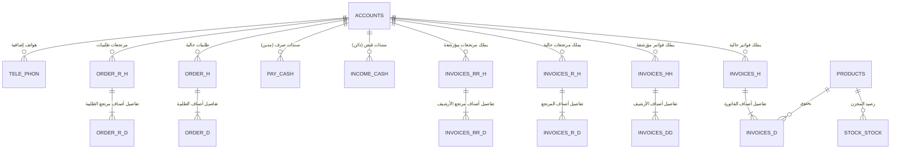

# 🗺️ الدليل الشامل وخريطة قواعد بيانات فايربيرد (ORGA SOFT ERP)

> **المرجع التقني الموحد لمستودعات الأدوية (XPharma Reference Map)**
> مستخرج ومطابق بنسبة 100% مع باك إند تبارك فارما المرجعي: `D:\xpharma\reference_tabarak`

---

## 📑 فهرس المحتويات

1. [نظرة عامة والبيئة التقنية](#1-نظرة-عامة-والبيئة-التقنية)
2. [خريطة الكيانات والجداول (Entity Relationship Map)](#2-خريطة-الكيانات-والجداول)
3. [مشتريات الصيدلية / فواتير المبيعات (Purchases &amp; Invoices)](#3-مشتريات-الصيدلية--فواتير-المبيعات)
4. [مرتجعات المبيعات (Sales Returns)](#4-مرتجعات-المبيعات)
5. [حركات النقدية والتحصيلات (Cash Flow)](#5-حركات-النقدية-والتحصيلات)
6. [الطلبيات وأوامر التوريد (Orders &amp; Deliveries)](#6-الطلبيات-وأوامر-التوريد)
7. [حسابات العملاء وحد الائتمان (Accounts &amp; Limits)](#7-حسابات-العملاء-وحد-الائتمان)
8. [المعادلة المحاسبية لحساب الرصيد (Balance &amp; Debt Formula)](#8-المعادلة-المحاسبية-لحساب-الرصيد)
9. [كشف الحساب الشامل (8-Way Union Statement Query)](#9-كشف-الحساب-الشامل)
10. [الأصناف ومخزون الأدوية (Products &amp; Inventory)](#10-الأصناف-ومخزون-الأدوية)
11. [معالجة النصوص العربية وترميز Windows-1256](#11-معالجة-النصوص-العربية)
12. [جدول الربط والتوافق مع منصة XPharma السحابية](#12-جدول-الربط-مع-xpharma)

---

## 1. نظرة عامة والبيئة التقنية

يعتمد نظام مستودع الأدوية (ORGA SOFT ERP) على محرك قواعد بيانات **Firebird 2.5 (Dialect 3)**:

- **ملف قاعدة البيانات الافتراضي**: `D:\ORGA_SOFT\DATA\ORGA.GDB` أو `C:\ORGA_SOFT\DATA\ORGA.GDB`
- **منفذ الاتصال الافتراضي**: `3050`
- **المستخدم الافتراضي**: `SYSDBA`
- **كلمة المرور الافتراضية**: `masterkey`
- **بروتوكول المصادقة**: `Legacy_Auth` (مع تعطيل تشفير الأسلاك `wire_crypt=false`)
- **ترميز الأحرف (Charset)**: يتم تخزين النصوص غالباً إما بترميز `NONE` أو `WIN1256` (Arabic Windows-1256).

> [!IMPORTANT]
> **قاعدة ذهبية في الاستعلام من Firebird:**
> جميع حقول المبالغ المالية مثل `TOTAL_TOTAL` و `CASH` و `MBALANCE` مخزنة بنوع `NUMERIC(15, 2)` أو `NUMERIC(15, 3)` مع مقياس عشري سالب. يجب دائماً تحويلها باستخدام:
> `CAST(TOTAL_TOTAL AS DOUBLE PRECISION)` أو `CAST(CASH AS DOUBLE PRECISION)` لتجنب أخطاء الفاصلة والتقريب في لغات البرمجة (Go / TypeScript).

---

## 2. خريطة الكيانات والجداول



---

## 3. مشتريات الصيدلية / فواتير المبيعات

في نظام المستودع، ما يُعد "فاتورة مبيعات" من وجهة نظر المستودع هو "مشتريات" من وجهة نظر الصيدلية.
يحتفظ النظام بجدولين رئيسيين:

1. `INVOICES_H`: الفواتير الحالية النشطة (Active Sales Invoices)
2. `INVOICES_HH`: الفواتير المرحلة / المؤرشفة (Archived/Secondary Invoices)

### جدول الرأس (Header Tables): `INVOICES_H` و `INVOICES_HH`

| الحقل (Column)                    | النوع الأصلي | الوصف واستخدام XPharma                                   | ملاحظات                                           |
| :------------------------------------- | :---------------------- | :-------------------------------------------------------------------- | :------------------------------------------------------- |
| `INVOICES_H_ID` / `INVOICES_HH_ID` | `INTEGER`             | المعرف الفريد للفاتورة (Primary Key)              | يتم ربطه مع السحابة كـ`remote_id`    |
| `DATE_D`                             | `DATE`                | تاريخ إصدار الفاتورة                                | بصيغة`YYYY-MM-DD`                                 |
| `TIME_T`                             | `TIME`                | توقيت إصدار الفاتورة                                | بصيغة`HH:MM:SS`                                   |
| `ACCOUNT_ID`                         | `INTEGER`             | كود الصيدلية / العميل                                | المفتاح الأجنبي لجدول`ACCOUNTS`     |
| `TOTAL_TOTAL`                        | `NUMERIC(15,2)`       | صافي القيمة الإجمالية للفاتورة             | يُستخدم:`CAST(TOTAL_TOTAL AS DOUBLE PRECISION)` |
| `TOTAL_DISCOUNT1`                    | `NUMERIC(15,3)`       | إجمالي الخصم التجاري للصيدلية               | قيمة الخصم الممنوح                       |
| `TOTAL_MONY_PAY`                     | `NUMERIC(15,3)`       | المبلغ المدفوع كاش فور تحرير الفاتورة | سداد فوري إن وجد                            |
| `TOTAL_`                             | `NUMERIC(15,2)`       | القيمة الإجمالية قبل الخصم                     | الإجمالي قبل الخصومات                 |
| `USERS_NAME`                         | `VARCHAR(25)`         | اسم الكاشير / موظف المبيعات                     | البائع المسؤول                              |
| `CUS_NAME`                           | `VARCHAR(40)`         | اسم الصيدلية أو ملاحظات الشحن                | البيان المدون على الفاتورة        |
| `COUNT_PROD`                         | `INTEGER`             | عدد الأصناف في الفاتورة                           | إجمالي البنود                                |
| `CLOSE_`                             | `SMALLINT`            | حالة إغلاق/ترحيل الفاتورة                       | `1` = مغلقة ومرحلة، `0` = مفتوحة   |
| `STORE_IN_TIME`                      | `VARCHAR`             | وقت دخول أمر التحضير بالمخزن                  | متابعة مسار التجهيز                     |
| `STORE_UP_TIME`                      | `VARCHAR`             | وقت بدء تجهيز البضاعة                               |                                                          |
| `STORE_OUT_TIME`                     | `VARCHAR`             | وقت خروج الفاتورة مع المندوب                  |                                                          |
| `BACET_ID`                           | `INTEGER`             | رقم الباسكت / الصندوق                                | ترتيب الطلبيات                              |
| `KARTONA1_ID`                        | `INTEGER`             | رقم الكرتونة                                               | التعبئة والتغليف                          |

### جدول بنود وتفاصيل الأصناف (Detail Tables): `INVOICES_D` و `INVOICES_DD`

| الحقل (Column) | النوع        | الوصف                                             | الربط والملاحظات                        |
| :------------------ | :---------------- | :----------------------------------------------------- | :----------------------------------------------------- |
| `INVOICES_H_ID`   | `INTEGER`       | كود الفاتورة الأصلية                 | ربط مع`INVOICES_H.INVOICES_H_ID`                |
| `PROD_ID`         | `INTEGER`       | كود الدواء / الصنف                       | المفتاح الأجنبي لـ`PRODUCTS.PROD_ID` |
| `TOTAL_QTY_ALL`   | `NUMERIC(15,3)` | الكمية المباعة للصيدلية           | إجمالي القطع/العلب                     |
| `CONSUMER`        | `NUMERIC(15,3)` | سعر الجمهور الرسمي (سعر البيع) | `CAST(CONSUMER AS DOUBLE PRECISION)`                 |
| `DISCOUNT1`       | `NUMERIC(15,3)` | نسبة الخصم الممنوحة للصنف        | نسبة مئوية                                    |
| `TOTAL_TOTAL`     | `NUMERIC(15,3)` | إجمالي سعر البند بعد الخصم       | `CAST(TOTAL_TOTAL AS DOUBLE PRECISION)`              |

---

## 4. مرتجعات المبيعات (Sales Returns)

تتم استعادة الأدوية المنتهية أو المرتجعة من الصيدلية عبر جداول المرتجعات:

1. `INVOICES_R_H`: رأس مرتجع المبيعات النشط
2. `INVOICES_RR_H`: رأس مرتجع المبيعات المرحل/الأرشيف
3. `INVOICES_R_D`: تفاصيل الأصناف المرتجعة
4. `INVOICES_RR_D`: تفاصيل أصناف المرتجع المؤرشفة

### حقول رأس المرتجع (`INVOICES_R_H` / `INVOICES_RR_H`):

```sql
SELECT 
    H.INVOICES_R_H_ID as ID,
    H.DATE_D,
    H.TIME_T,
    CAST(H.TOTAL_TOTAL AS DOUBLE PRECISION) as TOTAL,
    'R' as SRC,
    H.USERS_NAME as USR,
    H.ACCOUNT_ID
FROM INVOICES_R_H H
```

- **الأثر المحاسبي في كشف الحساب**: حركة **دائن (Credit)** للصيدلية تنقص من دينها للمخزن.
- **ربط البنود**: يتم الربط بين `INVOICES_R_H.INVOICES_R_H_ID = INVOICES_R_D.INVOICES_R_H_ID`.

---

## 5. حركات النقدية والتحصيلات (Cash Flow)

يحتوي النظام على جدولين أساسيين للنقدية:

### أ. سندات القبض / التحصيل من الصيدلية (`INCOME_CASH`)

- **النوع في السيستم**: `Kind = 11` (استلام نقدية)
- **الأثر المحاسبي**: حركة **دائن (Credit)** — تقلل مديونية الصيدلية.
- **الحقول الأساسية**:
  - `INCOME_CASH_ID`: رقم إيصال التحصيل
  - `DATE_D`: تاريخ السند
  - `TIME_T`: وقت السند
  - `CAST(CASH AS DOUBLE PRECISION)`: المبلغ المحصل
  - `ACCOUNT_ID`: كود الصيدلية
  - `USERS_NAME`: اسم المحصل أو الكاشير المستلم

### ب. سندات الصرف / المردودات النقدية للصيدلية (`PAY_CASH`)

- **النوع في السيستم**: `Kind = 12` (صرف نقدية / مردود نقدي)
- **الأثر المحاسبي**: حركة **مدين (Debit)** — تزيد مديونية الصيدلية أو تثبت استردادها لنقدية.
- **الحقول الأساسية**:
  - `PAY_CASH_ID`: رقم إذن الصرف
  - `DATE_D`: تاريخ السند
  - `TIME_T`: وقت السند
  - `CAST(CASH AS DOUBLE PRECISION)`: المبلغ المصروف
  - `ACCOUNT_ID`: كود الصيدلية
  - `USERS_NAME`: اسم الموظف المسؤول

---

## 6. الطلبيات وأوامر التوريد (Orders & Deliveries)

عند إرسال طلب أدوية قبل إصداره كفاتورة رسمية:

1. `ORDER_H`: رأس الطلبية (أمر التوريد)
2. `ORDER_D`: تفاصيل أصناف الطلبية
3. `ORDER_R_H`: مرتجع الطلبية
4. `ORDER_R_D`: تفاصيل مرتجع الطلبية

- في كشف حساب الصيدلية المرجعي:
  - `ORDER_H`: تعامل كـ Credit (أمر توريد)
  - `ORDER_R_H`: تعامل كـ Debit (مردود توريد)

---

## 7. حسابات العملاء وحد الائتمان (Accounts & Limits)

جدول العملاء والصيدليات المركزي هو **`ACCOUNTS`**:

| الحقل (Column)   | الوصف                                                   | الاستخدام                                 |
| :-------------------- | :----------------------------------------------------------- | :------------------------------------------------- |
| `ACCOUNT_ID`        | كود العميل / الصيدلية                       | المفتاح الأساسي (Unique Code)        |
| `ACCOUNT_NAME`      | اسم الصيدلية / العميل الرسمي          | يتم فك تشفيره من Win1256 إلى UTF-8 |
| `ACCOUNT_ADDRESS`   | عنوان الصيدلية بالتفصيل                 | العنوان                                     |
| `ACCOUNT_TEL1`      | رقم التليفون الأول                           | هاتف الاتصال                            |
| `ACCOUNT_TEL2`      | رقم التليفون الثاني                         | هاتف بديل                                  |
| `MBALANCE`          | رصيد بداية المدة (Opening Balance)             | `CAST(MBALANCE AS DOUBLE PRECISION)`             |
| `LIMIT_CASH`        | الحد الائتماني الأقصى المسموح به | `CAST(LIMIT_CASH AS DOUBLE PRECISION)`           |
| `INV_TYPE`          | تصنيف نوع الفاتورة للعميل              | تصنيف الفئات                            |
| `ACCOUNT_SELS_TYPE` | شريحة الخصم وسعر التعامل                | تحديد شرائح الخصم (A, B, C, D)      |

> [!TIP]
> **الهواتف الإضافية**: توجد هواتف الصيدليات الإضافية في جدول فرعي:
> `SELECT TEL_ FROM TELE_PHON WHERE ACCOUNT_ID = ?`

---

## 8. المعادلة المحاسبية لحساب الرصيد (Balance & Debt Formula)

لحساب مديونية الصيدلية الحالية بدقة تامة وبأسرع أداء ممكن في استعلام موحد واحد:

```sql
SELECT 
    (SELECT SUM(CAST(TOTAL_TOTAL AS DOUBLE PRECISION)) FROM INVOICES_H WHERE ACCOUNT_ID IN (:codes)) as d1,
    (SELECT SUM(CAST(TOTAL_TOTAL AS DOUBLE PRECISION)) FROM INVOICES_HH WHERE ACCOUNT_ID IN (:codes)) as d2,
    (SELECT SUM(CAST(CASH AS DOUBLE PRECISION)) FROM PAY_CASH WHERE ACCOUNT_ID IN (:codes)) as d3,
    (SELECT SUM(CAST(TOTAL_TOTAL AS DOUBLE PRECISION)) FROM ORDER_R_H WHERE ACCOUNT_ID IN (:codes)) as d4,
    (SELECT SUM(CAST(TOTAL_TOTAL AS DOUBLE PRECISION)) FROM ORDER_H WHERE ACCOUNT_ID IN (:codes)) as c1,
    (SELECT SUM(CAST(CASH AS DOUBLE PRECISION)) FROM INCOME_CASH WHERE ACCOUNT_ID IN (:codes)) as c2,
    (SELECT SUM(CAST(TOTAL_TOTAL AS DOUBLE PRECISION)) FROM INVOICES_R_H WHERE ACCOUNT_ID IN (:codes)) as c3,
    (SELECT SUM(CAST(TOTAL_TOTAL AS DOUBLE PRECISION)) FROM INVOICES_RR_H WHERE ACCOUNT_ID IN (:codes)) as c4,
    (SELECT SUM(CAST(MBALANCE AS DOUBLE PRECISION)) FROM ACCOUNTS WHERE ACCOUNT_ID IN (:codes)) as mbal,
    (SELECT SUM(CAST(LIMIT_CASH AS DOUBLE PRECISION)) FROM ACCOUNTS WHERE ACCOUNT_ID IN (:codes)) as lim
FROM RDB$DATABASE;
```

### المعادلة الرياضية الصافية:

$$
\text{Debits (مدين)} = d1 + d2 + d3 + d4
$$

$$
\text{Credits (دائن)} = c1 + c2 + c3 + c4
$$

$$
\mathbf{\text{Current Balance (الرصيد الحقيقي)}} = \text{MBALANCE} + \text{Debits} - \text{Credits}
$$

- **نوع الرصيد (Balance Type)**:
  - إذا كان الرصيد $\ge 0$: الصيدلية **مدينة (Debit)** للمخزن (عليها فلوس).
  - إذا كان الرصيد $< 0$: الصيدلية **دائنة (Credit)** لدى المخزن (لها رصيد زائد).
- **نسبة استهلاك حد الائتمان (Credit Limit Usage %)**:
  $$
  \text{Usage \%} = \frac{|\text{Current Balance}|}{\text{LIMIT\_CASH}} \times 100
  $$
- **الرصيد المتبقي المسموح به للشراء (Net Available Credit)**:
  $$
  \text{Net Available} = \text{LIMIT\_CASH} - \text{Current Balance}
  $$

---

## 9. كشف الحساب الشامل (8-Way Union Statement Query)

كشف الحساب الكامل يجمع كل المعاملات التي تمت على حساب الصيدلية مرتبة تنازلياً حسب التاريخ والوقت:

```sql
SELECT FIRST ? SKIP ?
    T.ID, T.DATE_D, T.TIME_T, T.TOTAL, T.SOURCE
FROM (
    -- 1. فواتير المبيعات الحالية (مدين)
    SELECT INVOICES_H_ID as ID, DATE_D, TIME_T, CAST(TOTAL_TOTAL AS DOUBLE PRECISION) as TOTAL, 'H' as SOURCE, ACCOUNT_ID 
    FROM INVOICES_H WHERE TOTAL_TOTAL <> 0
    UNION ALL
    -- 2. فواتير المبيعات المرحلة (مدين)
    SELECT INVOICES_HH_ID as ID, DATE_D, TIME_T, CAST(TOTAL_TOTAL AS DOUBLE PRECISION) as TOTAL, 'HH' as SOURCE, ACCOUNT_ID 
    FROM INVOICES_HH WHERE TOTAL_TOTAL <> 0
    UNION ALL
    -- 3. سندات القبض والتحصيل (دائن)
    SELECT INCOME_CASH_ID as ID, DATE_D, TIME_T, CAST(CASH AS DOUBLE PRECISION) as TOTAL, 'I' as SOURCE, ACCOUNT_ID 
    FROM INCOME_CASH WHERE CASH <> 0
    UNION ALL
    -- 4. سندات الصرف والمردودات النقدية (مدين)
    SELECT PAY_CASH_ID as ID, DATE_D, TIME_T, CAST(CASH AS DOUBLE PRECISION) as TOTAL, 'P' as SOURCE, ACCOUNT_ID 
    FROM PAY_CASH WHERE CASH <> 0
    UNION ALL
    -- 5. مرتجعات المبيعات الحالية (دائن)
    SELECT INVOICES_R_H_ID as ID, DATE_D, TIME_T, CAST(TOTAL_TOTAL AS DOUBLE PRECISION) as TOTAL, 'R' as SOURCE, ACCOUNT_ID 
    FROM INVOICES_R_H WHERE TOTAL_TOTAL <> 0
    UNION ALL
    -- 6. مرتجعات المبيعات المرحلة (دائن)
    SELECT INVOICES_RR_H_ID as ID, DATE_D, TIME_T, CAST(TOTAL_TOTAL AS DOUBLE PRECISION) as TOTAL, 'RR' as SOURCE, ACCOUNT_ID 
    FROM INVOICES_RR_H WHERE TOTAL_TOTAL <> 0
    UNION ALL
    -- 7. أوامر التوريد (دائن)
    SELECT ORDER_H_ID as ID, DATE_D, TIME_T, CAST(TOTAL_TOTAL AS DOUBLE PRECISION) as TOTAL, 'O' as SOURCE, ACCOUNT_ID 
    FROM ORDER_H WHERE TOTAL_TOTAL <> 0
    UNION ALL
    -- 8. مرتجع أوامر التوريد (مدين)
    SELECT ORDER_R_H_ID as ID, DATE_D, TIME_T, CAST(TOTAL_TOTAL AS DOUBLE PRECISION) as TOTAL, 'OR' as SOURCE, ACCOUNT_ID 
    FROM ORDER_R_H WHERE TOTAL_TOTAL <> 0
) T
WHERE T.ACCOUNT_ID IN (:pharma_codes)
ORDER BY T.DATE_D DESC, T.TIME_T DESC;
```

### تصنيف المعاملات وأثرها في الرصيد الجاري:

| كود المصدر (`SOURCE`) | مسمى الحركة                    |          مدين (Debit)          |         دائن (Credit)         | الأثر على مديونية الصيدلية |
| :------------------------------: | :--------------------------------------- | :---------------------------------: | :-------------------------------: | :------------------------------------------------ |
|              `H`              | فاتورة مشتريات (حالية) | **قيمة الفاتورة** |               0.00               | ⬆️ زيادة المديونية                |
|              `HH`              | فاتورة مشتريات (مرحلة) | **قيمة الفاتورة** |               0.00               | ⬆️ زيادة المديونية                |
|              `I`              | استلام نقدية (سند قبض)  |                0.00                |      **المبلغ**      | ⬇️ إنقاص المديونية                |
|              `P`              | مردود نقدي (سند صرف)      |       **المبلغ**       |               0.00               | ⬆️ زيادة المديونية                |
|              `R`              | مرتجع مشتريات (حالي)     |                0.00                | **قيمة المرتجع** | ⬇️ إنقاص المديونية                |
|              `RR`              | مرتجع مشتريات (مرحل)     |                0.00                | **قيمة المرتجع** | ⬇️ إنقاص المديونية                |
|              `O`              | أمر توريد / طلبية           |                0.00                |      **القيمة**      | ⬇️ إنقاص المديونية                |
|              `OR`              | مردود أمر توريد             |       **القيمة**       |               0.00               | ⬆️ زيادة المديونية                |

---

## 10. الأصناف ومخزون الأدوية (Products & Inventory)

يتم تخزين بيانات الأدوية والأسعار وشرائح الخصومات والمخزون في جدولين أساسيين:

1. `PRODUCTS`: كتالوج الأدوية وبيانات التسعير والباركود
2. `STOCK_STOCK`: أرصدة المخزون حسب المخزن (`STORE_ID = 1`)

```sql
SELECT FIRST 50
    P.PROD_ID,
    P.PROD_NAME,
    P.PROD_NAME_EN,
    CAST(P.CONSUMER AS DOUBLE PRECISION) as PRICE,
    CAST(P.DISCOUNT_B_1 AS DOUBLE PRECISION) as PHARMA_DISCOUNT,
    SUM(SS.TOTAL_QTY_ALL) as STOCK_QTY
FROM PRODUCTS P
LEFT JOIN STOCK_STOCK SS ON P.PROD_ID = SS.PROD_ID AND SS.STORE_ID = 1
GROUP BY P.PROD_ID, P.PROD_NAME, P.PROD_NAME_EN, P.CONSUMER, P.DISCOUNT_B_1
ORDER BY P.PROD_NAME ASC;
```

### شرائح الخصم في جدول `PRODUCTS`:

- `DISCOUNT_B_1` و `DISCOUNT_B_2`: الشريحة القياسية لصيدليات التعامل النقدي/الآجل.
- `DISCOUNT_A_1` و `DISCOUNT_A_2`: الشريحة الخاصة (VIP).
- `DISCOUNT_C_1` و `DISCOUNT_D_1`: شرائح خاصة بالكميات والمستشفيات.
- `BARCODE` و `BARCODE_U`: الباركود الدولي وباركود الوحدة الفرعية/الشريط.

---

## 11. معالجة النصوص العربية وترميز Windows-1256

لأن قواعد بيانات Firebird القديمة لا تخزن النصوص بـ UTF-8 افتراضياً، فإن قراءة النصوص كـ UTF-8 مباشرة تؤدي لظهور علامات استفهام `???` أو رموز غريبة `طµظٹط¯ظ„ظٹط©`.

### خوارزمية فك الترميز التلقائي (المطبقة في الـ Agent):

1. فحص البايتات: إذا كانت بايتات النص صالحة كـ UTF-8 سليم، تُستخدم مباشرة.
2. إذا فشلت، يتم تمريرها إلى محول **Windows-1256**:
   ```go
   import "golang.org/x/text/encoding/charmap"

   func decodeText(input []byte) string {
       if len(input) == 0 { return "" }
       if utf8.Valid(input) { return clean(string(input)) }

       decoder := charmap.Windows1256.NewDecoder()
       utf8Bytes, err := decoder.Bytes(input)
       if err != nil {
           return clean(string(input))
       }
       return clean(string(utf8Bytes))
   }
   ```
3. تنظيف رموز التحكم غير المرئية (Control Characters مثل `\x00` و `\r`).

---

## 12. جدول الربط مع منصة XPharma

| جدول فايربيرد (ORGA SOFT)                                                                                                  | جدول السحابة (PostgreSQL) | المسار في الـ Agent | الشاشة في لوحة تحكم الويب                   |
| :------------------------------------------------------------------------------------------------------------------------------------- | :----------------------------------- | :----------------------------- | :--------------------------------------------------------------- |
| `INVOICES_H` + `INVOICES_HH`                                                                                                       | `tenant_schema.invoices`           | `InvoiceSyncItem`            | تبويب**الفواتير** (`invoices`)              |
| `INVOICES_R_H` + `INVOICES_RR_H`                                                                                                   | `tenant_schema.returns`            | `ReturnSyncItem`             | تبويب**المرتجعات** (`returns`)             |
| `INCOME_CASH`                                                                                                                        | `tenant_schema.cash_receipts`      | `CashReceiptSyncItem`        | تبويب**سندات القبض** (`receipts`)         |
| `INVOICES_H` + `INVOICES_HH` + `INCOME_CASH` + `PAY_CASH` + `INVOICES_R_H` + `INVOICES_RR_H` + `ORDER_H` + `ORDER_R_H` | `tenant_schema.ledger_entries`     | `LedgerSyncItem`             | تبويب**كشف الحساب** (`ledger`)             |
| `ACCOUNTS` + `TELE_PHON`                                                                                                           | `public.pharmacies`                | `CustomerSyncItem`           | تبويب**الصيدليات والعملاء**          |
| `PRODUCTS` + `STOCK_STOCK`                                                                                                         | `tenant_schema.products`           | `ProductSyncItem`            | تبويب**كتالوج الأدوية والمخزون** |

---

**تاريخ التوثيق**: سبتمبر 2026
**المرجع**: مستخرج بدقة من الكود البرمجي الأصلي للمستودع `d:\xpharma\reference_tabarak`
